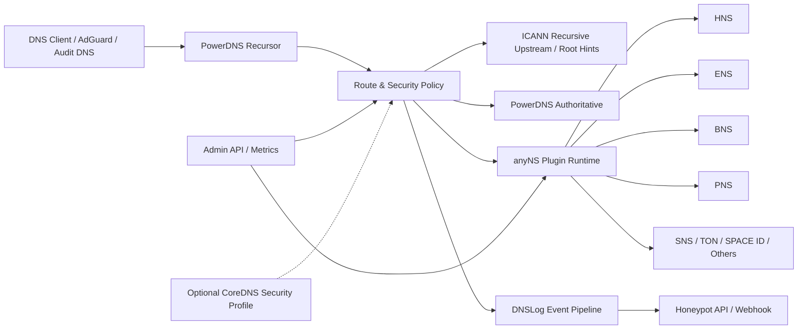

# 总体架构需求

## 1. 架构原则

- PowerDNS 是 anyNS 的核心运行面。
- 所有去中心化解析插件依附 PowerDNS。
- CoreDNS 是可选安全增强组件，优先级低于 PowerDNS 原生链路。
- ICANN 公网递归解析必须默认可用。
- 安全审计和 DNSLog 必须覆盖 ICANN 解析、去中心化解析和拦截动作。

## 2. 架构图

## 3. 组件职责

### PowerDNS Recursor

职责：

- 接收客户端 DNS 查询。
- 对接 ICANN 根提示或上游递归服务器。
- 提供缓存、DNSSEC、递归策略和 Lua hook。
- 执行路由策略，决定是否进入去中心化插件链。
- 生成查询日志、审计日志和 DNSLog 事件。

### PowerDNS Authoritative

职责：

- 管理本地权威区、测试区和托管记录。
- 存储插件输出的可持久化记录。
- 提供现代 RR 记录测试区。
- 支持 Remote Backend 或 SQL Backend 接入插件结果。

### 插件运行时

职责：

- 承载各去中心化 NS 插件。
- 封装链上 RPC、HTTP API、SDK 或本地节点调用。
- 输出统一 RRSet、RCODE、TTL、审计元数据和安全标签。
- 控制超时、重试、缓存和故障隔离。

### 管理 API

职责：

- 插件启停。
- 策略更新。
- 缓存清理。
- 健康检查。
- Prometheus metrics。
- 审计日志查询。
- 蜜罐转发状态查询。

### DNSLog/蜜罐联动服务

职责：

- 接收查询、解析和拦截事件。
- 标准化事件字段。
- 执行签名、批量、重试和失败队列。
- 投递蜜罐 API 或 Webhook。

### CoreDNS 可选 profile

职责：

- 作为可选安全增强层。
- 承接额外黑白名单、拦截、边缘节点策略。
- 与现有 CoreDNS 插件生态兼容。

限制：

- 不承载去中心化解析主逻辑。
- 不作为 PowerDNS 的替代入口。
- 不影响 PowerDNS 主链路的 ICANN 递归解析。

## 4. 查询链路

1. 客户端向 anyNS 发起 DNS 查询。
2. PowerDNS Recursor 接收请求并生成 trace id。
3. 安全预检查执行基础速率限制和黑白名单。
4. 路由策略判断是否命中去中心化插件。
5. 未命中插件时走 ICANN 递归或本地权威区。
6. 命中插件时调用插件运行时。
7. 插件返回 RRSet、RCODE、TTL 和元数据。
8. PowerDNS 返回 DNS 响应。
9. DNSLog 记录查询、插件、风险和响应。
10. 命中蜜罐转发策略时投递事件。

## 5. 部署拓扑

### 单机开发拓扑

- PowerDNS Recursor。
- PowerDNS Authoritative。
- 插件运行时。
- 管理 API。
- DNSLog/蜜罐转发服务。

### Docker Compose 拓扑

- `pdns-recursor`。
- `pdns-authoritative`。
- `anyns-plugin-runtime`。
- `anyns-admin-api`。
- `anyns-log-forwarder`。
- `coredns` 可选 profile。

### 生产拓扑建议

- PowerDNS Recursor 多实例。
- PowerDNS Authoritative 独立实例。
- 插件运行时横向扩展。
- 日志队列独立部署。
- 蜜罐转发服务异步化。
- Prometheus/Grafana 监控。

## 6. 可观测性

必须输出：

- 查询总量。
- RCODE 分布。
- 插件命中量。
- 插件延迟。
- 插件错误率。
- 缓存命中率。
- ICANN 递归延迟。
- 安全拦截量。
- 蜜罐投递成功率。
- 蜜罐失败队列长度。
